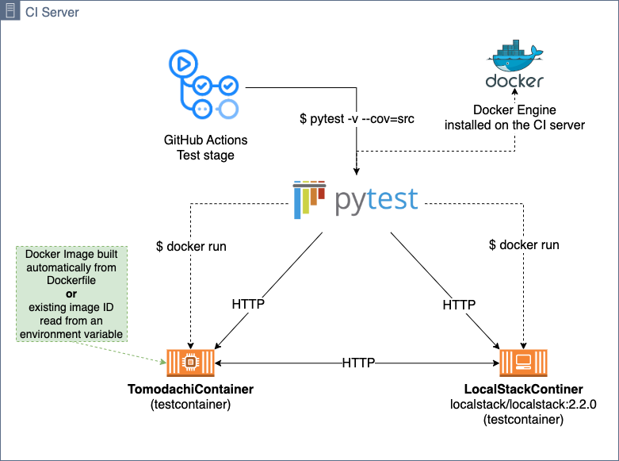
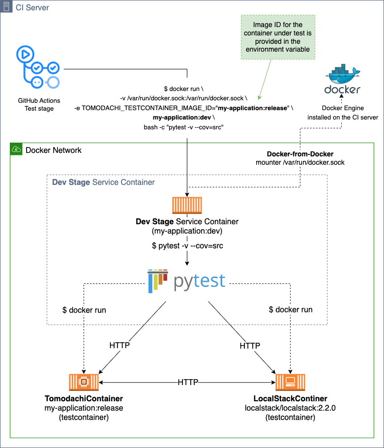

# testcontainers-github-actions

An example of how to run [Testcontainers](https://testcontainers.com/) in CI pipelines.
This example is using GitHub Actions, but the same ideas apply to other CI pipeline runners too.

Based on [tomodachi-testcontainers](https://github.com/filipsnastins/tomodachi-testcontainers)
and [testcontainers-python](https://github.com/testcontainers/testcontainers-python).

- [testcontainers-github-actions](#testcontainers-github-actions)
  - [Running Testcontainer tests in CI pipeline](#running-testcontainer-tests-in-ci-pipeline)
    - [1. Run tests directly on the CI server](#1-run-tests-directly-on-the-ci-server)
    - [2. Run tests from inside a Docker container](#2-run-tests-from-inside-a-docker-container)
  - [Resources](#resources)
  - [Development](#development)

## Running Testcontainer tests in CI pipeline

To run Testcontainers in the CI pipeline, you'll need a container runtime installed
on the CI server (GitHub Actions, Jenkins etc.). That's pretty much it!

Running Testcontainers in the CI shouldn't be much different from running them locally.

This example is using GitHub Actions, where the `ubuntu-latest` image has Docker Engine
pre-installed, so no extra setup is needed.

Generally there're _could be_ (probably there are more!) two approaches for running tests in CI pipelines:

### 1. Run tests directly on the CI server

Install programming language runtime and dependencies on the CI server,
and run the tests directly on the CI server too.
This approach example pipeline is in
[.github/workflows/build-and-test--on-ci-server.yml](.github/workflows/build-and-test--on-ci-server.yml)

- That's very similar to how tests are run on a local machine.
- This works really well with GitHub Actions, because after the workflow is finished,
  CI server is discarded and all the installed dependencies are removed,
  so the next workflow run starts from a clean state.
- A downside for this approach: tests won't be running in the exactly the same
  environment as the production environment. To fix this, we can run the tests from
  inside the application's Docker container - the deployment environment.



### 2. Run tests from inside a Docker container

The application code, its dependencies and the test suite are first packaged into a Docker image,
and the tests are run from inside the Docker container.

This approach example pipeline is in
[.github/workflows/build-and-test--with-dev-image.yml](.github/workflows/build-and-test--with-dev-image.yml)

- CI server only needs a container runtime installed, no other dependencies are needed.
- It usually requires a multi-stage Dockerfile with two stages:
  - `Development` - with development dependencies installed.
  - `Release` - with only production dependencies and production code.
- This approach isolates how the tests are run from the mechanics of
  the specific CI server you're using - the tests are always run in the same way,
  in exactly the same environment as production, because it's the same Docker image.

- How it works:
  - CI server runs a Docker image from the `development` stage, and runs the test command in the container.
  - However, since the application itself is tested as a (test)container,
    the container that's running the tests must be able to run new Docker containers.
  - This can be done with
    ["Docker-from-Docker"](https://code.visualstudio.com/remote/advancedcontainers/use-docker-kubernetes)
    method by mounting the Docker Unix socket from the host machine to the container.
    It will allow a container to run new containers on the host machine.
  - ⚠️ In the end-to-end tests, we want to test the exact same Docker image that's
    going to be deployed to production, so the tests must be ran against the `release` stage Docker image.
  - In case of [tomodachi-testcontainers](https://github.com/filipsnastins/tomodachi-testcontainers),
    use the environment variable `TOMODACHI_TESTCONTAINER_IMAGE_ID`
    to specify the image ID of the `release` stage.



## Resources

- [Testcontainers: Patterns for running tests inside a Docker container](https://java.testcontainers.org/supported_docker_environment/continuous_integration/dind_patterns/)

## Development

- Install dev dependencies with [Poetry](https://python-poetry.org/)

```bash
poetry install
poetry shell
pre-commit install
```

- Run tests

```bash
poetry run test
poetry run test-ci
```

- Format and lint code

```bash
poetry run format
poetry run lint
```

- Run all commit hooks at once

```bash
poetry run hooks
```
